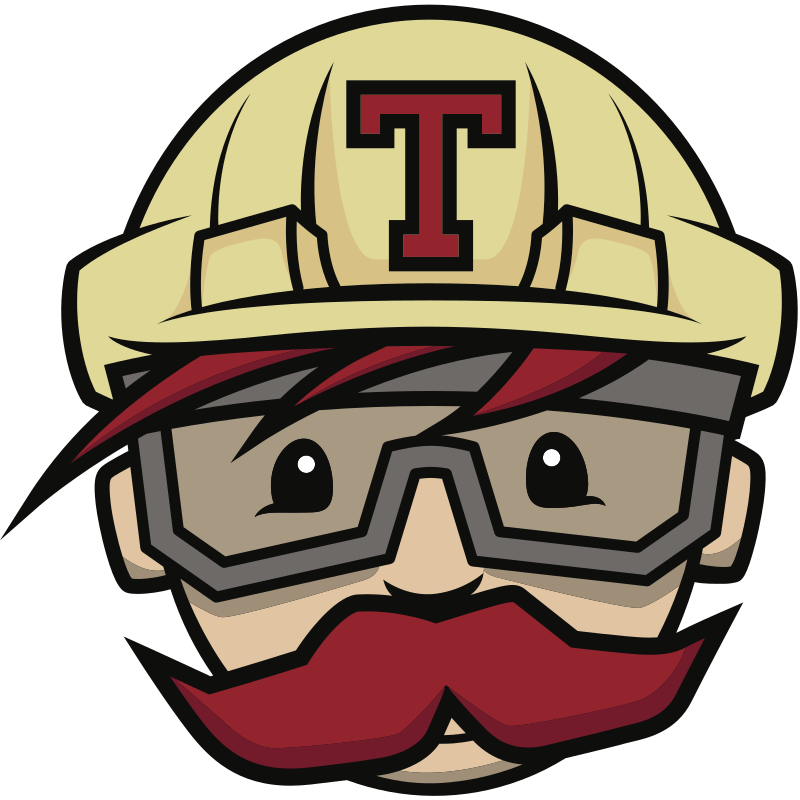
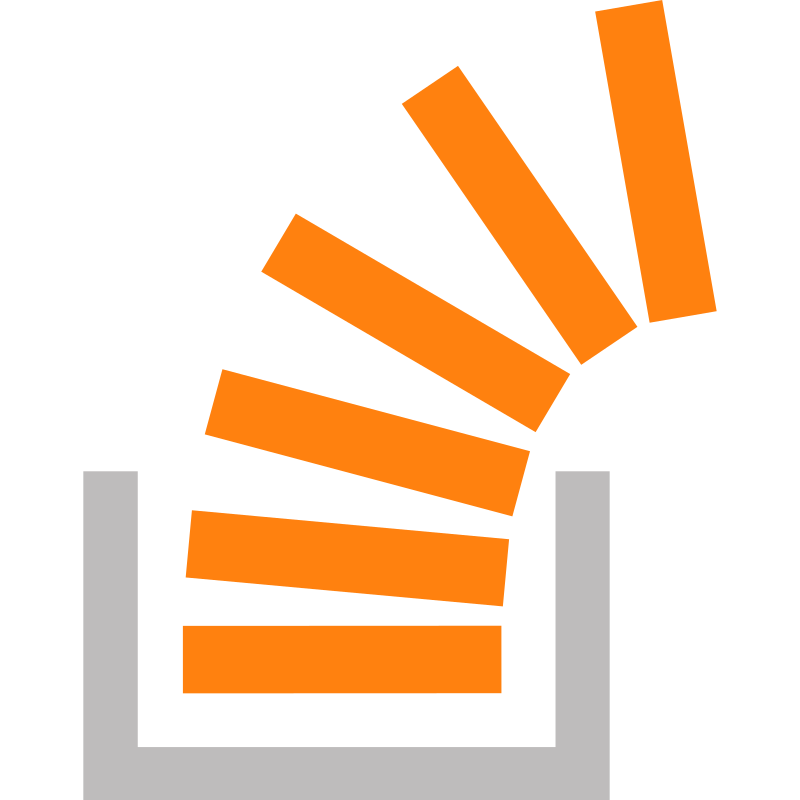

<h1 align="center">
  Hi 
  I’m Belka Hedia (aka <b>Zshmeta</b>)

<span align="center">
    
</span>
</h1>
<p align="center">
  Full‑stack × DevOps × AI • Linux enthusiast • I ship product, platforms, and prototypes
</p>

<p align="center">
  
</p>
    alt="Typing intro"
  />
</p>

<p align="center">
  
  
  
  
  
  
  
</p>

<p align="center">
  <a href="https://prod.zshmeta.dev">Portfolio</a>
  ·
  <a href="mailto:hedia.belka@gmail.com">hedia.belka@gmail.com</a>
  ·
  <a href="https://github.com/zshmeta">GitHub</a>
</p>

---

## Career Map

```mermaid
flowchart TD
  A["🌍 Curious human "] --> B["🧩 Life"]
  B --> C["🎓 Education: 
  Titre Nationale Developeur Concepteur d'application Fullstack"]
  C --> D["Work: 
  Full‑Stack developer UI • APIs • Data"]
  D --> E["🚀 Family and Friends"]
  E --> B

  subgraph Principles["How I like to work"]
    P1["Ingenuity"] --> P2["Observability"] --> P3["Learning"] --> P4["Achievability"] --> P5["Collaboration"] 
  end

  B --- Principles
  C --- Principles
  D --- Principles
```




## About

> *Développeur/Concepteur Full Stack et technicien informatique polyvalent, doté d’une expérience internationale et d’une forte capacité d’adaptation. Passionné par les nouvelles technologies et motivé par l’apprentissage continu, je combine une vision analytique, une approche rigoureuse et une réelle aisance à intégrer de nouveaux environnements. Habitué aux contextes complexes et multiculturels, j’apporte une contribution efficace aussi bien dans le développement d’applications que dans la gestion technique ou l’amélioration des processus.*

```text
JavaScript, TypeScript, PHP/Symfony, Node.js, React, PostgreSQL, Redis, Git, Docker, Linux, Bash, API REST, IA, LLMs, RAG, DevOps, CI/CD, Next.js, Tailwind CSS, Express.js, MongoDB, MySQL, Laravel, Nginx, Jenkins, GitLab CI, Travis CI, Azure DevOps, Linux (Arch, Debian, openSUSE, RedHat), System Administration, Networking, Security, Automation, Prompt Engineering etc....
```
## Now

- Open to: collaboration on thoughtful products (web, tooling, or AI‑adjacent)

## Stack (Icons Edition)

<div align="center">
<table align="center">
  <tr>
    <td valign="top" width="50%">
      <h3>Build</h3>
      <p>
        
        
        
        
        
        
        
        
        
      </p>
      <p>
        
        
        
        
      </p>
    </td>
    <td valign="top" width="50%">
      <h3>Ship</h3>
      <p>
        
        
        
        
        
        
      </p>
      <p>
        
        
        
        
      </p>
    </td>
  </tr>
  <tr>
    <td valign="top" width="50%">
      <h3>Run (Linux)</h3>
      <p>
        
        
        
        
        
        
      </p>
      <p>
        
        
        
      </p>
    </td>
    <td valign="top" width="50%">
      <h3>Think (AI)</h3>
      <p>
        
        
        
      </p>
      <p>
        
        
        
        
        
      </p>
    </td>
  </tr>
</table>

</div>

## Toolbox

<p align="center">
  &nbsp;
  &nbsp;
  &nbsp;
  &nbsp;
  &nbsp;
  &nbsp;
  &nbsp;
  &nbsp;
  &nbsp;
  &nbsp;
  &nbsp;
  &nbsp;
  
</p>

<p align="center">
  
  
  
  
  
  
</p>

## Interests

- Development (product + DX), design patterns, and pragmatic UX
- Machine learning, generative models, and developer tooling
- Cybersecurity, philosophy, psychology
- Traveling, writing/journalism, and anything that improves fairness

## Connect

<p align="center">
  <a href="https://www.buycoffee.to/zshmeta" target="_blank" rel="noreferrer">
    
  </a>
  &nbsp;
  <a href="https://t.me/zshmeta" target="_blank" rel="noreferrer">
    
  </a>
  &nbsp;
  <a href="https://codepen.io/zshmeta" target="_blank" rel="noreferrer">
    
  </a>
  &nbsp;
  <a href="https://stackoverflow.com/users/16273501/zshmeta" target="_blank" rel="noreferrer">
    
  </a>
  &nbsp;
  <a href="https://github.com/zshmeta" target="_blank" rel="noreferrer">
    
  </a>
  &nbsp;
  <a href="https://medium.com/@zshmeta" target="_blank" rel="noreferrer">
    
  </a>
  &nbsp;
  <a href="https://dev.to/zshmeta" target="_blank" rel="noreferrer">
    
  </a>
</p>

## GitHub

<p align="center">
  
</p>

<p align="center">
  
</p>

<p align="center">
  
</p>
